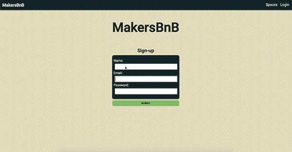

# MakersBnB

A web application that allows users to list spaces they have available, and to hire spaces for the night.  
Code with :heart: by :  
- [Andrew Wood](https://github.com/andrewwood2)  
- [Becky Sedgwick](https://github.com/rebeccasedgwick)  
- [Dave Lawes](https://github.com/DaveLawes/)  
- [Esam Al-Dabagh](https://github.com/EsamAl-Dabagh)  
- [Mathilde Ferrand](https://github.com/ChocolatineMathou)  
- [Rashika Patel](https://github.com/cbp10)



## MVP

Users can list spaces on the web application that are visible to all.

## Technologies
This project was built with Javascript with the the MVC [Express](https://expressjs.com/) as it seemed easy to set up for a first experience.  
Our testing framework is [Jasmine](https://jasmine.github.io/) paired with:  
- [Zombie](http://zombie.js.org/) to test the user experience of this web-based application  
- [Istanbul](https://istanbul.js.org/) to get the test coverage.  
[ESLint](https://eslint.org/) has been set up in this project (ES6 by default) to get a better knowledge of Javascript style guidelines.  
[Sequelize](http://docs.sequelizejs.com/) is an ORM for Node.js.

## How to install

### Setting up the databases
To play with this project, you'll need to set up a test and production cloud-based databases (we used this [service](https://www.elephantsql.com/)) with SQLite as dialect (you can also use PostreSQL, MySQL, MariaDB or MSSQL but you'll need to change some settings).
Once you get the links of your databases, you need an `.env` at the root of the project and paste the links into it:  
```ENV_DATABASE=your_database_url  
ENV_TEST_DATABASE=your_test_database_url
```
For each database, you need two tables: users and properties. This set up will be written soon.

### Setting up the project
Make sure you already have Node.js on your machine or download it from [here](https://nodejs.org/en/).
You can now move to the following steps:
```
$ git clone git@github.com:DaveLawes/MakersBnB.git  
cd MakersBNB  
npm install
node app.js
```
Then in your favorite browser type `localhost:3000/` to access the homepage.

## How to test
In your terminal:  
- type `npm test` to run Jasmine/Zombie tests and get the test coverage  
- type `./node_modules/.bin/eslint yourfile.js` to run ESLint.

Test coverage after the last commit:  
Statements   : 95.65% ( 176/184 )  
Branches     : 62.5% ( 5/8 )  
Functions    : 91.67% ( 55/60 )  
Lines        : 95.6% ( 174/182 )

## User Stories

```
As a property owner
So I can list a property
I'd like to create an account

As a property owner
So I can list a property
I'd like to add my property and some basic property details

As a user
So I can see listed properties
I'd like the web app to show all listings

As a user
So I can add another property
I want to be able to log in

As a system admin
So that I do not have unassociated properties
Only logged in users can add a property listing

```


### Headline specifications

- Any signed-up user can list a new space. :white_check_mark:
- Users can list multiple spaces. :white_check_mark:
- Users should be able to name their space, provide a short description of the space, and a price per night. :white_check_mark:
- Users should be able to offer a range of dates where their space is available.
- Any signed-up user can request to hire any space for one night, and this should be approved by the user that owns that space.
- Nights for which a space has already been booked should not be available for users to book that space.
- Until a user has confirmed a booking request, that space can still be booked for that night.

### Nice-to-haves

- Users should receive an email whenever one of the following happens:
 - They sign up
 - They create a space
 - They update a space
 - A user requests to book their space
 - They confirm a request
 - They request to book a space
 - Their request to book a space is confirmed
 - Their request to book a space is denied
- Users should receive a text message to a provided number whenever one of the following happens:
 - A user requests to book their space
 - Their request to book a space is confirmed
 - Their request to book a space is denied
- A ‘chat’ functionality once a space has been booked, allowing users whose space-booking request has been confirmed to chat with the user that owns that space
- Basic payment implementation though Stripe.

## Team's feedbacks

This challenge has been our first group project at Makers.  
We started with a MVP in Ruby/Sintra but also two spike solutions: a second MVP using Javascript/Express and an ORM paired with a cloud-based database alternative. Naturally we added an extra layer of challenge by working with a brand new stack.
We have learned a lot:  
- Working in team  
- GitHub: branches, merging, pull requests and reviews  
- Quitting VIM  
- Using Node.js and Express with new testing tools

Obviously there are some drawbacks. We may have spent quite some time to set everything up and discover this new environment which could have been frustrating to understand how they work.

## Appendix - team documentation

- [CRC Cards](./crc-cards.md)  
- [Domain model](./domain_model)  
- [Goals and Strategies](./goals_and_strategies.md)  
- [ORM for Javascript investigation](./orm_for_javascript)  
- [Testing in Node.js](./testing_in_node)
